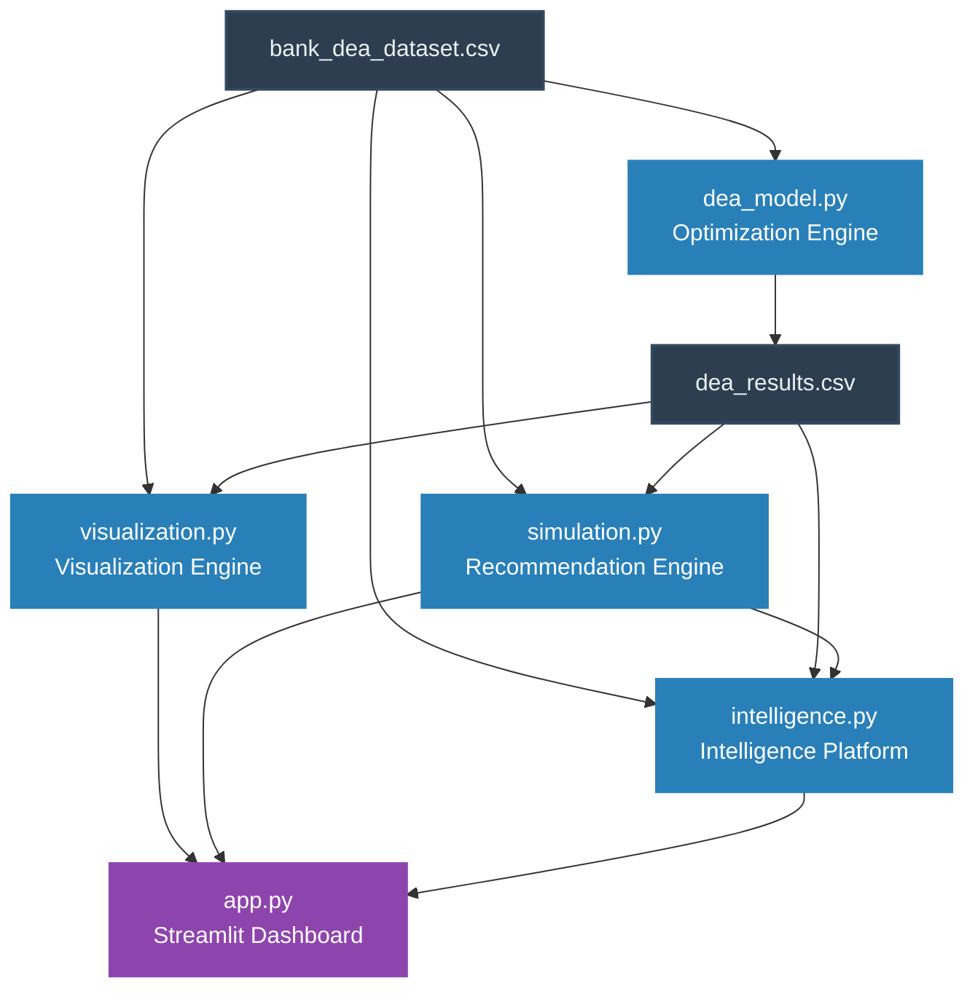

# DecisionLens Architecture

## System Block Diagram

## Module Descriptions

### 1. Data Envelopment Analysis (DEA) Engine (`dea_model.py`)
- **Role:** The core mathematical optimization engine (Phase 2).
- **Functionality:** Processes the bank branch data (`bank_dea_dataset.csv`) and runs a CCR (Charnes-Cooper-Rhodes) input-oriented Linear Programming model using the PuLP library. It calculates the definitive efficiency score for every branch and categorizes them as "Efficient" or "Inefficient". 
- **Outputs:** Saves the calculated scores to `dea_results.csv`.

### 2. Visualization Engine (`visualization.py`)
- **Role:** Generates analytical and visual components (Phase 3).
- **Functionality:** Provides reusable charting functions leveraging Plotly to display efficiency data. 
- **Key Visualizations:** Efficiency Leaderboards, Score Distributions, Frontier Scatter Plots (Input vs. Output), Radar Comparisons (Benchmarking), and Geographic Maps.

### 3. Simulation & Recommendation Engine (`simulation.py`)
- **Role:** Provides actionable insights and what-if simulation (Phase 5).
- **Functionality:** Computes mathematical "slacks" for inefficient branches, translating input excesses and output shortfalls into actionable recommendations (e.g., "Reduce staff units"). Includes a fast, single-branch What-If simulator to predict efficiency changes if inputs/outputs are adjusted, and a target mode to find the exact reductions needed to hit a goal score.

### 4. Intelligence Platform (`intelligence.py`)
- **Role:** Functions as the "AI Business Consultant" (Phase 6).
- **Functionality:** Elevates raw numbers into business interpretations. It performs Root Cause Analysis against top efficient peers, generates a human-readable NLP-style insights summary explaining why a branch is underperforming, and runs Sensitivity Analysis to recommend the highest ROI actions. 

### 5. Interactive BI Dashboard (`app.py`)
- **Role:** The frontend UI and user experience layer (Phase 4).
- **Functionality:** A production-grade Streamlit application that unifies all engines into a single, cohesive dashboard viewing experience. It controls global state, manages responsive routing between analysis tabs (Overview, Branch Analysis, Geospatial Map, Simulator, Scenarios), and handles user input filtering.
